# TRACE Graph — UI guide

What each page shows, what the visual language means, and which question each view answers.
Screenshots were taken against the bundled mock fixture (256 objects, 918 links, ~940 claims); the real
environments show the seeded SP01 slice with the same layout.

---

## The visual language (everywhere)

| Encoding | Meaning |
|---|---|
| **Colour** | the object **type** — one palette, used identically in the graph, the badges, the legend and the coverage bars |
| **Size** | how connected the object is (base weight per type + degree), not importance and not money |
| **Opacity / fading** | QA band: `low` is drawn faded, never hidden — weak statements stay visible and labelled |
| **Teal highlight** | the current hover or selection and its immediate neighbourhood; everything else fades back |
| **Badges** | type, QA band, QA score, claim count, and — in the registry — claim status |

Header: environment badge from `/health`, live object/link/claim counts, ⌘K search, the write-key dialog,
dark-mode toggle. Footer: *“TRACE prototype — public data — assumptions, not decisions.”*

---

## 1. Explore (`/`) — the network graph

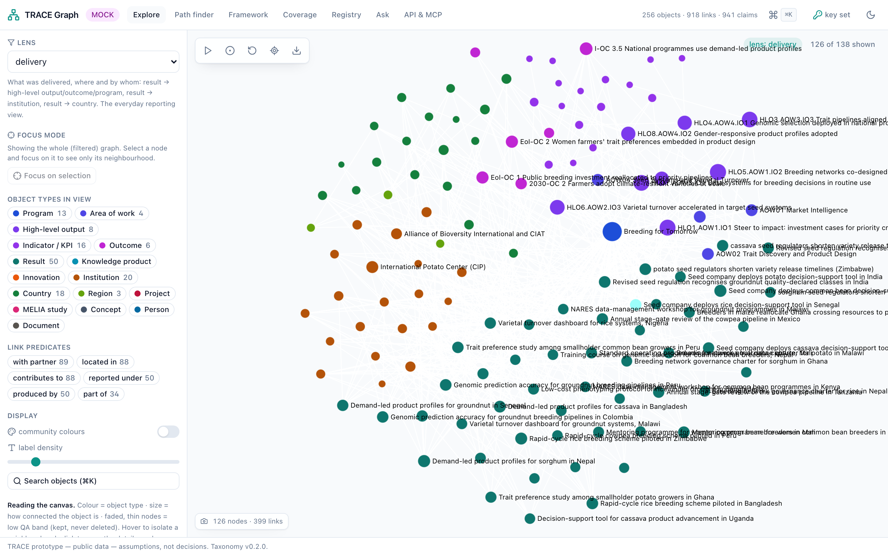

The WebGL canvas (sigma.js) with a left rail of controls:

* **Lens** — pick one of the five named path rules (`portfolio`, `delivery`, `evidence`, `money`,
  `partnership`); the description under the selector says in plain words what it allows. Without a lens you
  get “everything connected to everything”, which is rarely the question you are asking. With a lens,
  objects the lens never connects are hidden rather than left floating.
* **Focus mode** — show only the neighbourhood of one object at depth 1–3 (`/api/objects/{id}/neighbourhood`).
* **Object types in view** — the legend doubles as a filter, with live counts of what is currently drawn.
* **Link predicates** — the same, for edges.
* **Display** — community colouring (Louvain) as a toggle, label-density slider, and ⌘K search.

Canvas interactions: hover isolates a neighbourhood · click opens the detail drawer · **double-click expands**
that node's neighbourhood and merges it into the current graph · edge hover shows the predicate, both ends
and the link attributes · toolbar = run/stop ForceAtlas2, circular layout, reset, centre on selection,
**export PNG**.

### Detail drawer

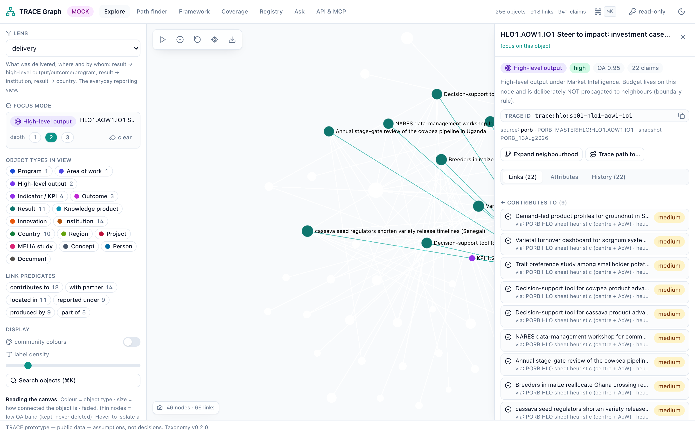

For the selected object: type + QA band + score + claim count, description, copyable TRACE id, the source
system/ref/snapshot, and three tabs —

* **Links** — grouped by predicate and direction with counts; each row shows the link attributes (money
  formatted) and its band; clicking a row walks to that object.
* **Attributes** — the attribute table (URLs linked, budget values marked as *held here, not propagated*),
  the alternate identifiers (copyable, with outbound links for handles and DOIs), and the taxonomy tags.
* **History** — the append-only claim timeline: who attested it, when, provenance (signed / recorded /
  harvested), evidence links, and what it supersedes.

Two actions: *Expand neighbourhood* and *Trace path to…* (hands the object to the path finder).

Dark theme:

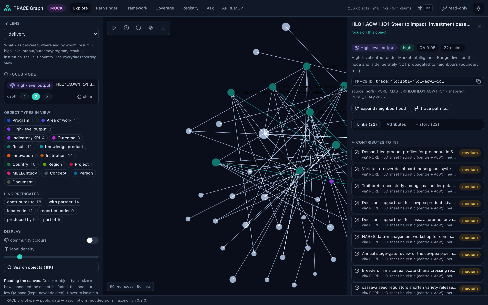

### Command palette (⌘K)

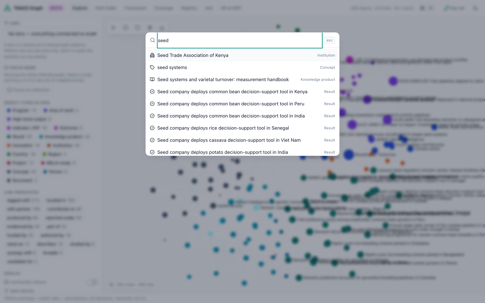

Debounced search over `/api/objects?q=`, plus jump-to-page entries. Arrow keys + Enter; picking an object
focuses it in Explore.

---

## 2. Path finder (`/path`) — “how do these two things connect?”

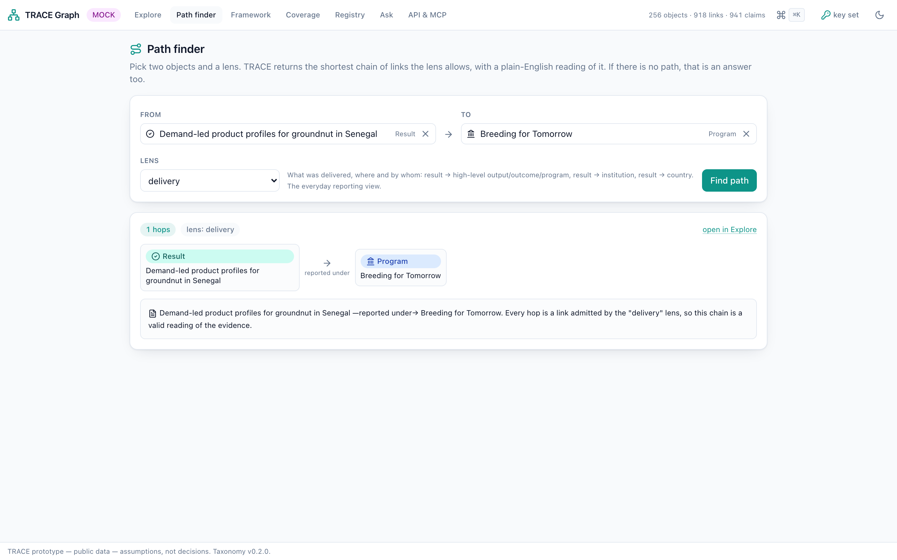

Two search boxes and a lens. The API returns the shortest chain the lens admits; the UI renders it as a
horizontal chain of typed cards with the predicate on each arrow, plus the plain-English explanation and an
*open in Explore* link.

The interesting case is the refusal:

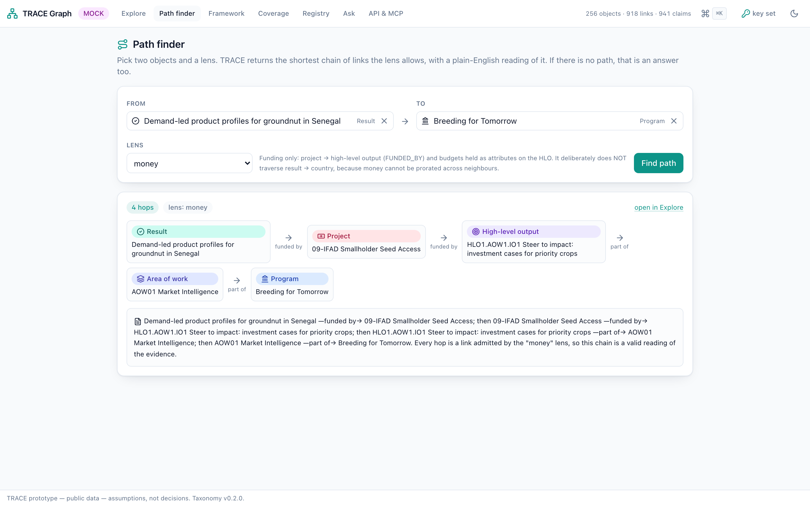

The same two objects are connected under `delivery` and **not** under `money`, because the money lens never
walks result → country — budgets cannot be prorated across neighbours. The page says so instead of drawing
a line that would invite a wrong sum.

---

## 3. Framework (`/framework`) — the results framework

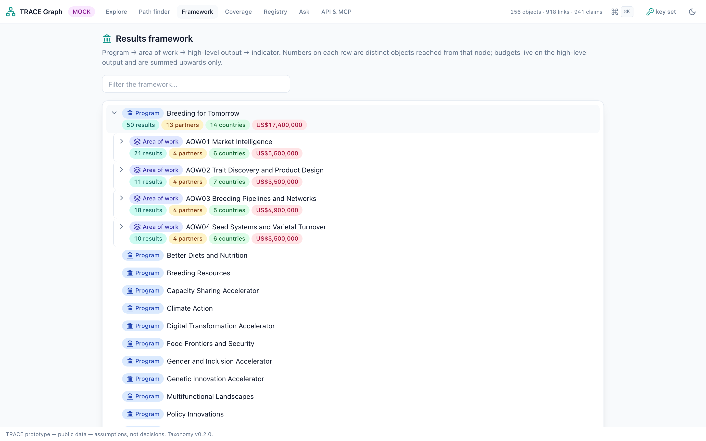

The PRMS hierarchy as a collapsible tree: **program → area of work → high-level output → indicator/KPI**.
Each row carries distinct counts of results, partners and countries reached from that node, and the budget.

Two rules are visible here: counts are **count-distinct by TRACE id** (an object reached by three paths is
still one object), and budgets are summed **upward only** from the high-level output that owns them — never
spread sideways to partners, countries or results. Clicking any row opens it in Explore under the
`portfolio` lens.

---

## 4. Coverage (`/coverage`) — taxonomy coverage and gaps

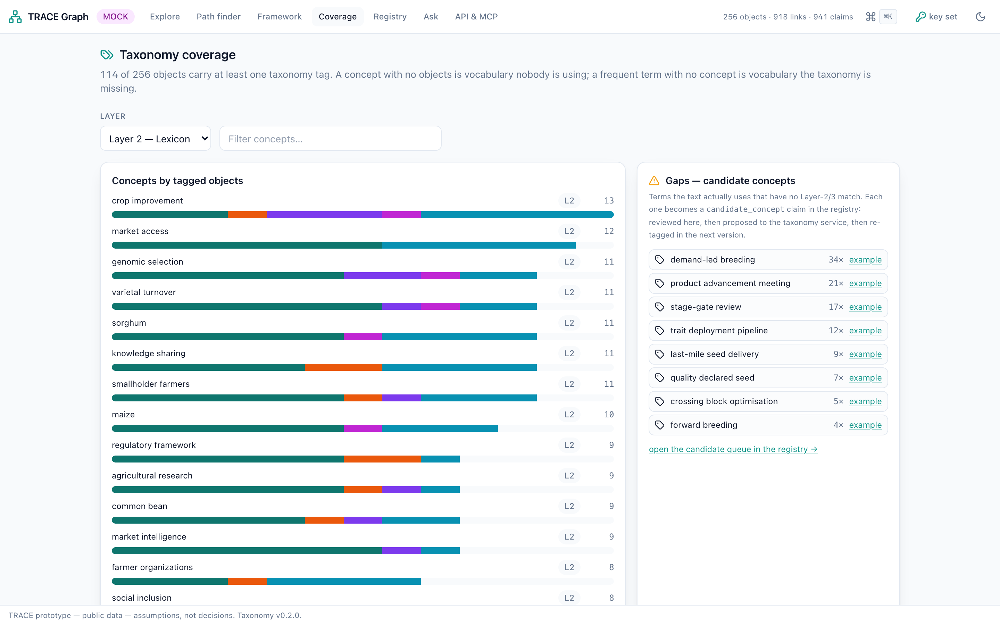

Left: concepts ranked by number of tagged objects, each bar split by object type (same palette), filterable
by taxonomy layer (1 = AI graph, 2 = Lexicon, 3 = climate adaptation).

Right: the **gaps panel** — frequent terms in the text that have no Layer-2/3 match. Each becomes a
`candidate_concept` claim: reviewed in the registry, proposed to the taxonomy service, re-tagged in the next
version. That is Jules' reconciliation loop, made visible.

---

## 5. Registry (`/registry`) — claims, QA and review

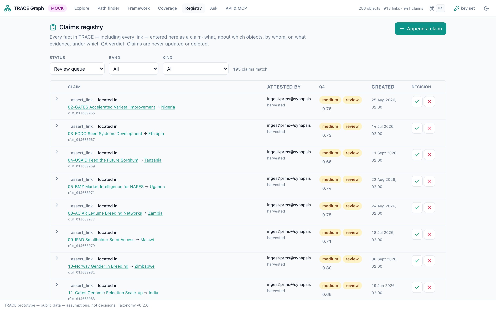

The append-only log with filters (status, band, kind). Expanding a row shows the **QA check detail**
(`well_formed`, `id_resolvable`, `duplicate`, `taxonomy_resolvable`, `plausible_geo`, `plausible_time`,
`evidence_present`, `provenance_strength`), the payload and the evidence. Claims in `review` can be accepted
or rejected (`POST /api/claims/{id}/decide`); rejected claims stay in the list, labelled.

### Append a claim — QA before you write

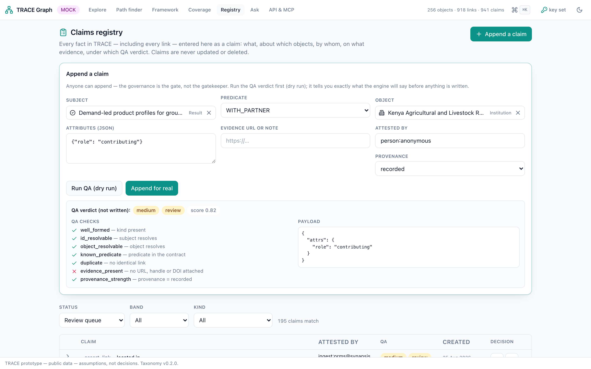

Pick subject, predicate and object by search, add attributes (JSON), evidence and who is attesting, then
**Run QA (dry run)** — `POST /api/claims?dry_run=1` returns the verdict without writing anything, so you see
exactly what the gate will say. *Append for real* needs the write key from the header dialog.

---

## 6. Ask (`/ask`) — question the graph

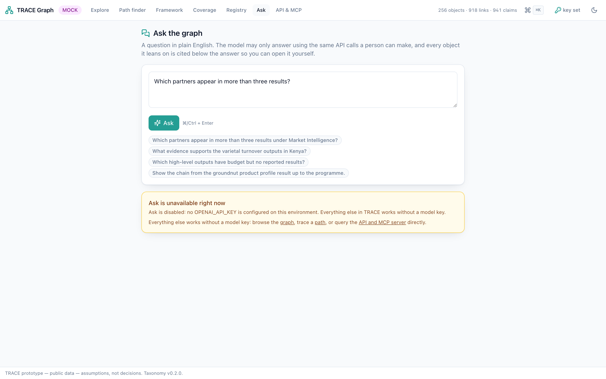

A question box over `POST /api/ask`. The answer is rendered with the **objects it cited** as chips (each
opens in Explore) and the **tool calls** it made, so the reasoning is inspectable. When the environment has
no model key the API answers 503 and the page says so plainly and points at what still works — the model is
optional in TRACE, not load-bearing.

---

## 7. API & MCP (`/api-guide`) — the machine side

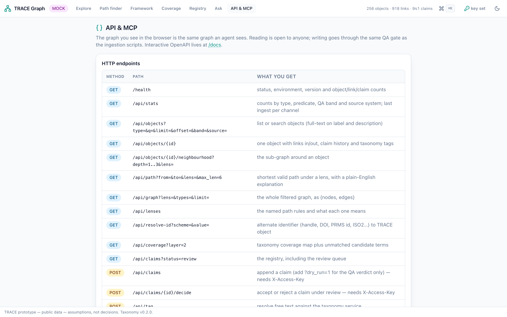

Static reference for a visitor who wants the data rather than the pictures: the HTTP endpoint table, the
JSON shapes, copy-ready curl examples (including the dry-run claim), the MCP tool list with a Claude
configuration snippet, and the six “rules of the game” (persistent ids · everything is a claim · nothing is
overwritten · count distinct · budgets have boundaries · use a lens).

---

## Accessibility and responsiveness

* Light theme by default with a dark toggle (stored per browser, honours `prefers-color-scheme` on first load).
* Keyboard: ⌘/Ctrl-K palette, arrow keys + Enter, Escape closes drawers and dialogs, visible focus rings.
* Every interactive control has an accessible name; graph state is also readable as text (counts, chips, drawer).
* Designed down to a 13" laptop (1280×800): the graph canvas fills the viewport, the left rail collapses
  below `lg`, and the navigation wraps to its own row.
